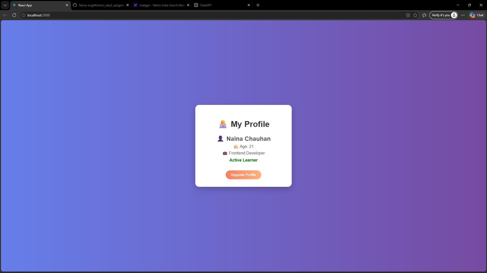

## Live Demo
https://mern-day2-assignment.vercel.app/

## Profile App (React)

A simple and responsive Profile Application built using React.
This project displays user information like name, age, profession, and other details using reusable components.

## Features

- Display user profile details (Name, Age, Profession)
- Clean and simple UI
- Reusable React components
- Responsive layout
- Beginner-friendly project

## Tech Stack

- React JS
- JavaScript
- HTML
- CSS

 ## Project Structure

src/
├── components/
│    └── Profile.js
├── App.js
├── index.js
├── App.css

 ## Screenshots

 ## How to Run

cd profile-app

npm install

npm start

## Future Improvements

- Add profile image
- Add edit functionality
- Improve UI design
- Add multiple profiles
